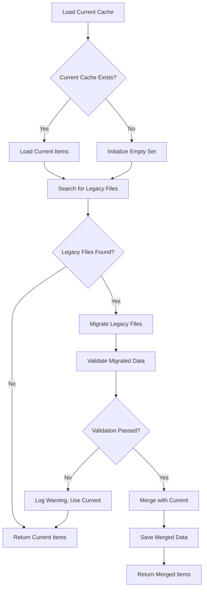

# Cache Migration System

## Overview

Buntspecht includes an automatic cache migration system that prevents duplicate message sending when cache formats or locations change during software updates. This system ensures that previously processed items are preserved across upgrades, preventing users from experiencing message floods.

## Problem Statement

When software is refactored and cache file formats change, the following issues can occur:

1. **Data Loss**: Old cache files are no longer recognized
2. **Duplicate Messages**: All previously processed items are sent again
3. **User Impact**: Message floods on social media platforms
4. **Manual Intervention**: Users need to manually manage cache files

## Solution: Automatic Cache Migration

The cache migration system automatically:

- ✅ **Detects legacy cache files** in various formats and locations
- ✅ **Merges data** from old and new cache files
- ✅ **Preserves all processed items** to prevent duplicates
- ✅ **Creates backups** of legacy files before migration
- ✅ **Validates data integrity** during migration
- ✅ **Logs detailed information** about the migration process

## Architecture

### Core Components

#### 1. CacheMigrator (`src/messages/multiJson/CacheMigrator.ts`)
The main migration engine that handles:
- Legacy cache file detection
- Format identification and parsing
- Data validation and merging
- Backup creation

#### 2. MessageDeduplicator (`src/messages/multiJson/MessageDeduplicator.ts`)
Integrates migration into the cache loading process:
- Loads current cache files
- Triggers migration when needed
- Merges current and legacy data
- Saves merged results

#### 3. Integration Points
- **MultiJsonCommandProvider**: Uses MessageDeduplicator for cache management
- **Test Suite**: Comprehensive tests for all migration scenarios

## Supported Legacy Formats

The migration system supports multiple legacy cache file formats:

### 1. Processed Array Format (Current)
```json
["1", "2", "3", "4"]
```
**Description**: Simple array of processed item IDs (current format)

### 2. Configuration Cache Format
```json
{
  "processedItems": ["item1", "item2", "item3"],
  "lastCheck": "2023-01-01T00:00:00Z",
  "version": "1.0"
}
```
**Description**: Configuration object with embedded processed items array

### 3. Object with Items Format
```json
{
  "items": ["a", "b", "c"],
  "metadata": {
    "version": "2.0",
    "created": "2023-01-01"
  }
}
```
**Description**: Object containing items array and metadata

### 4. Flat Object Format
```json
{
  "1": true,
  "2": true,
  "3": false,
  "4": 1,
  "5": 0
}
```
**Description**: Flat key-value pairs where truthy values indicate processed items

### 5. Complex Objects Format
```json
[
  { "id": "obj1", "processed": true },
  { "uniqueId": "obj2", "status": "done" },
  { "key": "obj3", "data": "test" },
  { "identifier": "obj4" }
]
```
**Description**: Array of objects with various ID field names

## Migration Process

### 1. Cache Loading Flow



### 2. Legacy File Detection

The system searches for cache files in multiple locations and patterns:

```
./cache/{provider}-cache.json
./cache/{provider}_cache.json
./cache/{provider}.json
./{provider}.json
./data/{provider}_processed.json
./tmp/{provider}_processed.json
./cache/{provider}_items.json
./cache/{provider}_sent.json
./cache/{provider}_done.json
./{provider}_processed.json
./data/{provider}_processed.json
```

### 3. Data Merging Strategy

```typescript
// Pseudo-code for merging process
const currentItems = loadCurrentCache();     // ["4", "5", "6"]
const legacyItems = migrateLegacyFiles();   // ["1", "2", "3", "5"]
const mergedItems = new Set([
  ...currentItems,
  ...legacyItems
]);
// Result: ["1", "2", "3", "4", "5", "6"] (no duplicates)
```

## Configuration

### Automatic Operation
The migration system works automatically without configuration:

```toml
# No special configuration needed
[[providers]]
name = "my-provider"
type = "multijsoncommand"
command = "echo '[{\"id\": 1, \"message\": \"test\"}]'"
template = "{{message}}"
# Migration happens automatically when cache is loaded
```

### Cache Configuration
Standard cache configuration applies:

```toml
[[providers]]
name = "my-provider"
type = "multijsoncommand"
command = "echo '[{\"id\": 1, \"message\": \"test\"}]'"
template = "{{message}}"

[providers.cache]
enabled = true                                    # Enable caching (default: true)
ttl = 1209600000                                 # Cache TTL in ms (default: 14 days)
maxSize = 10000                                  # Max cache entries (default: 10000)
filePath = "./cache/my-provider-cache.json"      # Cache directory path
```

## Validation and Safety

### Data Validation
The migration system validates migrated data to ensure integrity:

```typescript
// Validation checks
✅ Reasonable data size (< 100,000 items)
✅ Valid ID formats (no newlines, reasonable length)
✅ Proper data types (strings/numbers only)
✅ No suspicious content
```

### Backup Creation
Before migration, legacy files are backed up:

```
Original: ./cache/old-provider.json
Backup:   ./cache/old-provider.json.pre-migration-backup
```

### Error Handling
- **Parse Errors**: Invalid JSON files are skipped with warnings
- **Validation Failures**: Suspicious data is rejected, current cache is used
- **File System Errors**: Graceful fallback to current cache or fresh start

## Logging and Monitoring

### Migration Logs
The system provides detailed logging during migration:

```
[INFO] Migrated 3 processed items from legacy cache: ./cache/old-provider.json
[INFO] Successfully merged 4 legacy items (3 new) with 3 current items for provider: my-provider
[DEBUG] All 2 legacy items were already in current cache for provider: my-provider
[WARN] Migration validation failed for provider my-provider, using only current cache
```

### Log Levels
- **DEBUG**: File detection, validation details
- **INFO**: Successful migrations, merge statistics
- **WARN**: Validation failures, parse errors
- **ERROR**: Critical failures (rare)

## Testing

### Test Coverage
The migration system includes comprehensive tests:

```
✅ 11 CacheMigrator unit tests
✅ 5 Integration tests for merge scenarios
✅ 27 MultiJsonCommandProvider tests (including migration)
✅ Error handling and edge cases
✅ All legacy format migrations
```

### Test Scenarios
1. **Format Migration**: Each legacy format → current format
2. **Data Merging**: Current + legacy → merged result
3. **Error Handling**: Invalid JSON, suspicious data
4. **Edge Cases**: Empty caches, no legacy files, validation failures
5. **Integration**: Full provider workflow with migration

## Troubleshooting

### Common Issues

#### 1. Migration Not Triggered
**Symptoms**: Legacy cache files exist but aren't migrated
**Causes**: 
- Files in unexpected locations
- Invalid JSON format
- Validation failures

**Solutions**:
```bash
# Check log output for migration attempts
grep -i "migration\|legacy" logs/buntspecht.log

# Verify file locations and formats
ls -la ./cache/*cache*.json
cat ./cache/provider-name.json | jq .
```

#### 2. Validation Failures
**Symptoms**: Warning logs about validation failures
**Causes**:
- Too many items (>100,000)
- Suspicious ID formats
- Corrupted data

**Solutions**:
```bash
# Check cache file size and content
wc -l ./cache/legacy-file.json
head -20 ./cache/legacy-file.json

# Manual cleanup if needed
cp ./cache/legacy-file.json ./cache/legacy-file.json.backup
# Edit file to remove suspicious entries
```

#### 3. Duplicate Messages After Migration
**Symptoms**: Messages sent again despite migration
**Causes**:
- Migration didn't find the correct legacy files
- Different provider names used
- Cache disabled

**Solutions**:
```bash
# Verify provider names match
grep "provider.*name" config.toml

# Check if cache is enabled
grep -A5 "\[.*cache\]" config.toml

# Manually merge cache files if needed
```

### Debug Mode
Enable debug logging to see detailed migration information:

```toml
[logging]
level = "debug"
```

## Best Practices

### For Users

1. **Backup Before Upgrades**: Always backup your cache directory before major upgrades
2. **Monitor Logs**: Check logs after upgrades to verify successful migration
3. **Consistent Naming**: Use consistent provider names across configurations
4. **Regular Cleanup**: Let the system clean up old backup files automatically

### For Developers

1. **Version Documentation**: Document cache format changes in release notes
2. **Migration Testing**: Test migration paths when changing cache formats
3. **Backward Compatibility**: Consider migration impact when refactoring
4. **Format Detection**: Add new legacy format support when needed

### Adding New Legacy Formats

To support a new legacy cache format:

1. **Add Format Detection**:
```typescript
// In CacheMigrator.detectCacheFileType()
if (data && data.myNewFormat) {
  return 'my_new_format';
}
```

2. **Add Migration Logic**:
```typescript
// In CacheMigrator.migrateSingleCacheFile()
case 'my_new_format':
  if (data.myNewFormat && Array.isArray(data.myNewFormat)) {
    data.myNewFormat.forEach(item => processedItems.add(String(item)));
  }
  break;
```

3. **Add Tests**:
```typescript
it('should migrate from my new format', () => {
  const legacyData = { myNewFormat: ['item1', 'item2'] };
  // Test migration logic
});
```

## Performance Considerations

### Migration Performance
- **File I/O**: Migration involves reading multiple files
- **Memory Usage**: Large cache files are loaded into memory
- **Processing Time**: Validation and merging add processing overhead

### Optimization Strategies
- **Lazy Loading**: Migration only runs when cache is accessed
- **Validation Limits**: Reasonable limits prevent excessive processing
- **Cleanup**: Old backup files are cleaned up automatically

### Monitoring
- **Startup Time**: Monitor for increased startup time after upgrades
- **Memory Usage**: Watch for memory spikes during large migrations
- **Log Volume**: Migration can generate significant log output

## Future Enhancements

### Planned Improvements
1. **CLI Commands**: Manual migration triggers and status checks
2. **Migration Reports**: Detailed reports of what was migrated
3. **Selective Migration**: Choose which legacy files to migrate
4. **Compression**: Compress large cache files
5. **Remote Caches**: Support for remote cache storage

### Extension Points
The migration system is designed to be extensible:

- **New Providers**: Other providers can use the same migration system
- **Custom Formats**: Easy to add support for new legacy formats
- **Validation Rules**: Configurable validation criteria
- **Storage Backends**: Support for different storage systems

## Conclusion

The cache migration system ensures that Buntspecht upgrades are seamless and don't result in duplicate message sending. By automatically detecting, migrating, and merging cache data from various legacy formats, users can upgrade with confidence knowing their processed message history is preserved.

The system is designed to be robust, well-tested, and extensible, providing a solid foundation for handling cache format changes in the future.